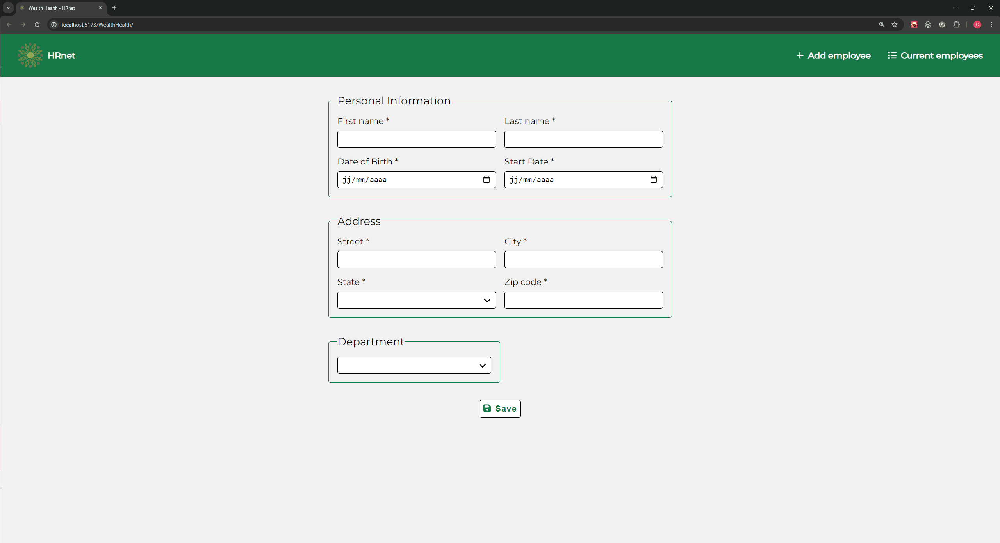
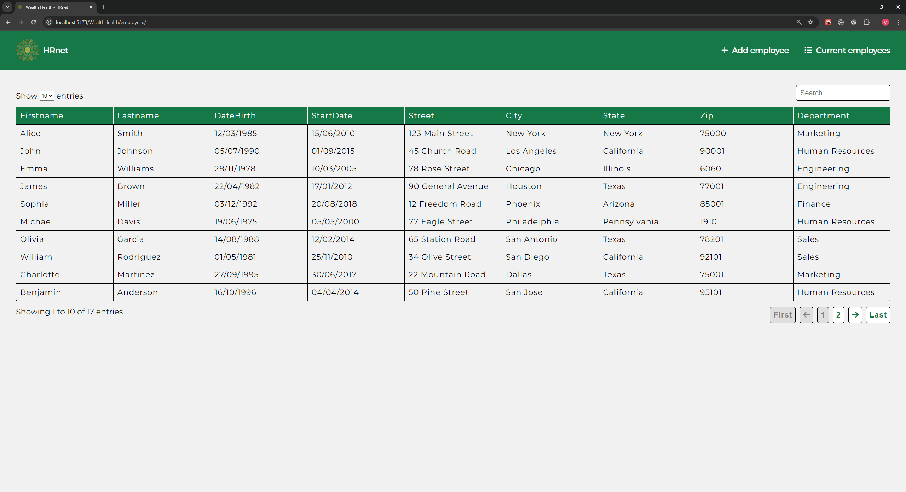

# Formation Développeur d'application - JavaScript React

## 📎 Projet 14 : Wealth Health - Faites passer une librairie jQuery vers React





## Technologies :
- REACT
- SASS

## Installation :
Installer les dépendances avec la commande `npm install`

 

## Tester le projet :

```terminal
git clone https://github.com/Cyril-Develop/WealthHealth.git
```
